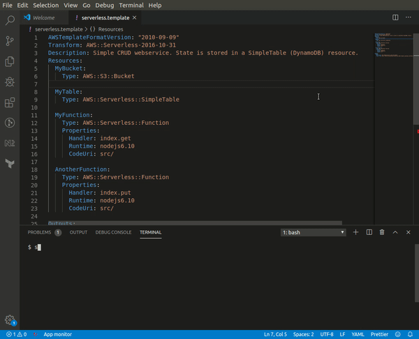

## sam-policies-cli

CLI tool to browse and inject [AWS Policy Templates](https://docs.aws.amazon.com/serverless-application-model/latest/developerguide/serverless-policy-templates.html) into the `Policies` array of an `AWS::Serverless::Function` in a [SAM](https://docs.aws.amazon.com/serverless-application-model/latest/developerguide/what-is-sam.html) template

## Installation
`npm install -g @mhlabs/sam-policies-cli`

## Usage
```
Options:
  -v, --vers                 output the current version
  -f, --format <json|yaml>   Select output format (default: "json")
  -t, --template <filename>  Template file name (default: "serverless.template")
  -h, --help                 output usage information

```

## Example


## Caveats
* Both JSON and YAML options will reformat your template, but especially  JSON shouldn't break it. It's therefore a good idea to run this command on a template without any local changes so you can easily diff the injection and reformatting. For safety it will create a backup of your template in <template_filename>_backup before making any changes.
* CloudFormation and SAM Policy Templates are inconsistent with which intrinsic function should be used to inject the resource identifier to the policy template transformation. Sometimes it's `!Ref` and sometimes `!GetAtt` We're making a manual mapping which _could_ be wrong and assumes `!Ref` when no mapping exists.

